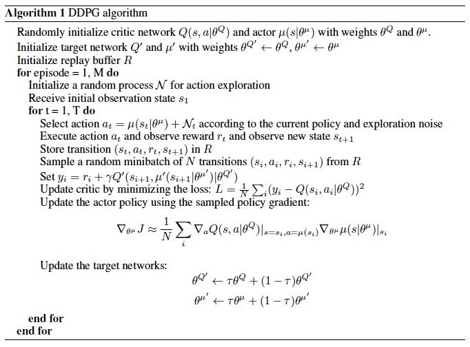
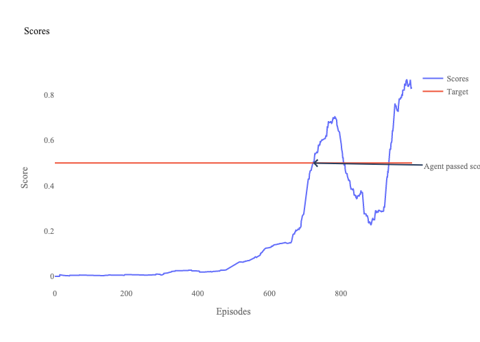
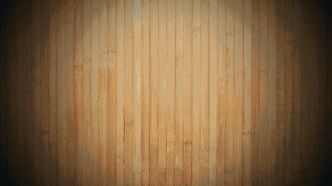

# Solve Tennis Unity Environment with DDPG

## DDPG Model Details

The deep deterministic policy gradient (DDPG) was introduced by Google Deepmind in their Continuous Control with Deep Reinforcement Learning [paper](https://arxiv.org/abs/1509.02971). DDPG uses Deep Q-Learning ideas to solve continuous action environments. DDPG uses a deterministic policy, which allows it to ouput actions directly from a deep neural network (DNN).


DDPG consists of an actor and a critic DNN. The actor ouputs an action based on the state. Critic ouputs Q-value based on state and action. This Q-value is the expected future reward.

In this project, I used a six-layer fully-connected network for both actor and critic.

Model details:

- Actor
    - Layer one
        - Input size: State dimension
        - Type: Fully Connected
        - Units: 400
        - Activation: ReLU
    - Layer two
        - Units: 300
        - Type: Fully Connected
        - Activation: ReLU
    - Layer three
        - Units: 200
        - Type: Fully Connected
        - Activation: ReLU
    - Layer four
        - Units: 100
        - Type: Fully Connected
        - Activation: ReLU
    - Layer five
        - Units: 50
        - Type: Fully Connected
        - Activation: ReLU
    - Layer six
        - Type: Batch Normalization
        - Units: 50
    - Layer seven
        - Output size: Number of Actions
        - Type: Fully Connected
        - Activation: tanh


- Critic
    - Layer one
        - Input size: State dimension
        - Units:400
        - Type: Fully Connected
        - Activation: ReLU
    - Layer two
        - Units: 300 + State dimension
        - Type: Fully Connected
        - Activation: ReLU
    - Layer three
        - Units: 200
        - Type: Fully Connected
        - Activation: ReLU
    - Layer four
        - Units: 100
        - Type: Fully Connected
        - Activation: ReLU
    - Layer five
        - Units: 50
        - Type: Fully Connected
        - Activation: ReLU
    - Layer six
        - Output size: 1
        - Type: Fully Connected
        - Activation: Linear

Here is the DDPG algorithm:



*This Image is taken from the original paper [here](https://arxiv.org/abs/1509.02971).*

## Training

To train an agent, I used the following hyperparameters:

- Hyperparameters:
    - Replay buffer size: 1e6
    - Batch size: 1024
    - Discount factor (gamma): 0.99
    - Soft update weights factor (tau): 1e-3
    - Actor learning rate: 1e-4
    - Critic learning rate: 1e-3
    - Weight decay coefficient: 0
    - Noise distribution: Normal (Gaussian Process)

Replay buffer is a memory of different actions and environment trajectories. The batch size indicates how many trajectories to sample from replay buffer for training the actor. The discount factor is used to calculate Q targets. The learning rates are used for training the actor and critic DNNs. I used AdamW optimization with a weight decay cofficient of 0.

### Training Attempts

In my first attempt, I used shallower networks for critic and actor. Those network consisted of 3 layers each. I also used a Ornstein Uhlenbeck process for adding noise to actions. The model did not reach the desired score for more than 20000 episodes. 

I increased the model networks sizes by adding extra layers. The model scores improved a bit but did not reach the desired score for about 20000 episodes.

I changed the noise to Normal process. I also added a batch normalization layer to actor network. I also set the model to update the network each 10 episodes. The model was trained for 722 episodes to pass the score of 0.5 on average for one of agents over past 100 episodes.

## Results

On my machine, the environment was solved in 722 episodes:

```
Episode 100	Average Score: 0.00400
Episode 200	Average Score: 0.00780
Episode 300	Average Score: 0.00600
Episode 400	Average Score: 0.02550
Episode 500	Average Score: 0.04760
Episode 600	Average Score: 0.12620
Episode 700	Average Score: 0.31120

Environment solved in 722 episodes!	Average Score: 0.50260
Trained model weights saved to: checkpoint_722.pth

```



Here is a video of untrained vs trained models:

[](https://youtu.be/EXans1mpJBs)

## Future Work

In future, I plan to update the repo to use other algorithms such as Distributed Distributional Deterministic Policy Gradients (D4PG) to solve the environment.

## Author
  - **Sina Fathi-Kazerooni** - 
    [Website](https://sinafathi.com)
